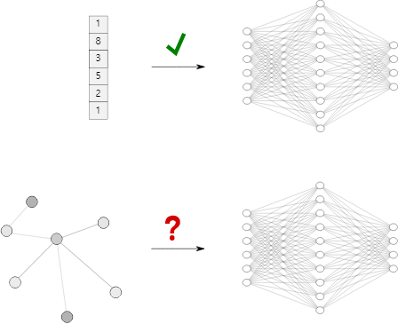
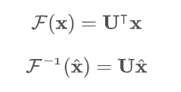
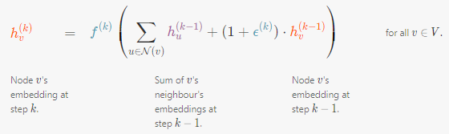

# Understanding Convolutions on Graphs

https://distill.pub/2021/understanding-gnns/

# Introduction

기존 neural network는 고정된 크기 , 정규화된 구조를 가진 데이터만이 입력으로 활용 될 수 있음 

social networks, molecules과 같은 irregular/non-euclidean 데이터를 다루기 위해 필요

# **Extending Convolutions to Graphs**

일반적인 convolution 연산 graph 위에서 할 수 있을까? 대답은 NO

## [**Spectral Graph Convolution**](https://ralasun.github.io/deep%20learning/2021/02/15/gcn/)

### **Message Passing**

고정된 이웃 노드 말고도 멀리 연결되어 있는 노드의 정보도 시간이 흐르면서 밀려 들어올 수 있음

Graph 내 Signal은 여러 노드로부터 오는 Signal이 모두 섞여있어 어떤 노드로부터 오는 Signal인지 구분이 어렵다

### **Fourier Transform**

임의의 입력 신호를 다양한 주파수를 갖는 주기 함수들의 합으로 분해하여 표현

Graph 내 Signal을 푸리에 변환으로 분해하자!

### Graph Laplacian

Graph에서 푸리에 변환 어떻게 할까?

그래프 푸리에 변환 = 그래프의 **Laplacian Matrix** 을 **Eigen Decomposition**

### **Laplacian Matrix**

라플라시안 행렬의 의미는?

라플라시안 행렬을 사용하면 노드와 주변 노드들과의 차이를 구할 수 있음 (변화량?)

### **Eigen Decomposition**

내 노드와 주변 노드간 변화량을 가져다주는 라플라시안 행렬에서 중요한 성분을 추출해본다면?

Quadratic Form —> Minimization —> Lagrange Multiplier —> Eigen Decompostion

Laplacian matrix의 eigenvalue: 특정 노드와 유사하거나 상이한 정도

Laplacian matrix의 eigenvector: 특정 노드와 유사한 노드와 상이한 노드를 구분하는 기준

작은 값의 eigenvalue에 대응되는 eigenvector에 projection —> 

혼재되어 있는 signal 중 유사한 이웃 노드에서 들어오는 signal의 성분을 추출

큰 값의 eigenvalue에 대응되는 eigenvector에 projection —> 

혼재되어 있는 signal 중 멀리 있는 상이한 노드에서 들어오는 signal의 성분을 추출

위 그림에서 각 eigenvector가 대응되는 eigenvalue의 크기는 다음과 같다

u2 < u3 < u4 < u8

eigenvalue 크기가 작을수록 가까운 거리에 존재하는 요소들끼리 비슷한 색을 가지는 반면에 eigenvalue 크기가 크면 클수록 먼 거리에 존재하는 요소들끼리 묶여 색을 띈다

임의의 입력 신호를 다양한 주파수를 갖는 주기 함수들의 합으로 분해하여 표현

## [Polynomials of the Laplacian](https://proceedings.neurips.cc/paper/2016/file/04df4d434d481c5bb723be1b6df1ee65-Paper.pdf)

### Spectral filtering of graph signals

아마 푸리에 변환 (graph signal x에 eigen vector를 내적) 후 분해된 signal들을 어느 정도 반영할지(covolution)를 정하기 위해 parameter가 들어가는 것으로 추정됨.. 

Node 개수 만큼 parameter 존재하기에 learning complexity O(n)

### Polynomial parametrization

그런데 그래프 내 존재하는 모든 Node를 각 Node를 embedding 할 때마다 수행하는 건 너무 비효율적

한 노드 볼때 K-hop 만큼만 확인하자!

parameter가 hop 별로 존재 —> learning complexity O(K)

위와 같이 polynomial filter 구조로 변경

### Chebyshev Polynomial

그러나 여전히 푸리에 변환으로 인한 eigen decomposition 너무 많은 연산

푸리에 변환 과정 approximation을 이뤄 아래 Embedding 과정을 보면 알 수 있겠지만 eigenvector를 graph signal에 내적하는 과정이 생략됨

### ChebNet Embedding

# **Modern Graph Neural Networks**

## Graph Convolutional Networks (GCN)

쳬비셰프 다항식에 영향 받아 0hop과 1hop 만 사용하는 것으로 더 연산량을 줄임

Aggregating과 Combining을 K번 반복하여 K-hop information을 얻음

## Graph Attention Networks (GAT)

neighbor node와 얼마나 유사한지 판단하고 그를 기반으로 aggregate에 반영

## Graph Sample and Aggregate (GraphSAGE)

aggregate function (aggregator)이 learnable

neighbor node sampling

## Graph Isomorphism Network (GIN)

Mean/Max Aggregation은 다른 구조를 가지는 그래프를 detect하지 못하는 한계점 존재 Sum Aggregation

