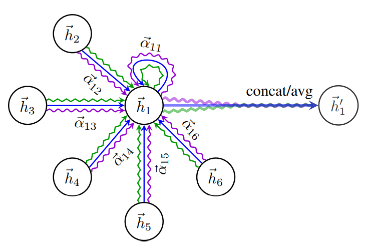

https://arxiv.org/pdf/1710.10903.pdf

# 1 Introduction

Grid-Like Structure data에 유효성을 보인 CNN (filter를 학습가능한 파라미터와 함께 reuse)

다른 데이터들도 다 grid 였으면 좋겠지만,, 대부분 irregular함 (3D meshes, social networks, telecommunication networks, biological networks or brain connectomes)

이런 데이터를 임의로 (arbitrarily) 구조화시켜 nn으로 다룰려고 많은 시도 있었음

DAG를 갖는 graph domain에서 RNN을 사용

RNN의 generalization으로 GNN 등장 (cyclic, directed and undirected graph domain에서도 사용)

GNN은 iterative한 process를 가지, nn을 통해 각 node가 평형(?)을 이룰떄까지 propagate (각 노드별로 자신의 이전 상태를 반영하여 output을 생성) 

이는 후에 GRU(gated recurrent units)를 사용하는 형태로 발전

Convolution 연산 적용하려는 시도도 있었고 이러한 시도는 spectral / non-spectral 접근으로 나뉨

graph Laplacian을 eigen-decomposition 함으로써 Fourier Domain 내 그래프 convolution 연산 수행하여 non-spatially localized filter를 이끌어냄

spatially localized 하게 만들기 위해 spectral filter에 smooth coefficients을 달아줘서 parameterization함 (라플라시안 다항식)

Graph Laplacian을 Chebyshev expansion을 이용해 filter들을 approximate함으로써 Laplacian의 eigenvector를 계산하는 과정을 지웠음 **(Chebyshev Polynomial)**

위 과정마저 1-step neighborhood 에 작용하도록 filter에 restrict하여 간소화 (GCN)

하지만 여전히 학습된 filter들은 별도로 Laplacian eigendecomposition 수행을 진행하지 않아도 되지만, **Laplacian matrix 자체 (graph structure)에 의존적이다.** 

그래서, 학습된 모델은 해당 구조를 갖는 graph에만 적용 가능하고, 다른 구조의 graph에는 적용이 되지 않는다.

Non-Spectral Approaches

그래프에 직접적으로 Convolution 수행 (가까운 neighbor들에 대해서만 spatial하게)

다른 사이즈의 neighborhoods 에 대한 convolution operator를 define하고 CNN의 weigh sharing 특성을 지켜내는 것이 주요한 challenge

이를 위해선, 각 노드의 degree별로 specific weight matrix를 학습하거나

transition matrix를 이용해 node의 채널과 degree별로 weight를 학습하여 neighborhood를 정의하거나

고정된 사이즈의 node들을 neighborhood로 뽑고 nomalize한다.

CNN 아키텍처를 그래프로 통일하여 일반화한 mixture model CNNs (Monet) 또한 발표되었다.

고정된 사이즈의 neighborhood를 구하고 aggregator를 학습하는 GraphSAGE는 inductive 방법으로 node representation을 구한다.

Attention Mechanism (de facto standard in sequence-based task)

attention mechanism의 장점은 크기가 변할 수 있는 input에 강하다는 점이고, decision을 making 할 때 가장 연관성이 높은 부분을 input에서 찾아 낼 수 있다.

한 sequence에 대한 representation을 attention mechanism을 통해 구할 때 우리는 self-attention이라고 한다.

self-attention은 RNN과 convolution 연산을 향상시키는 능력을 가지고 있는 것으로 알려져있다.

본 논문에서는 attention-based 구조를 통해 node classification을 하고자 한다.

주요 아이디어는 self-attention 을 통해 주변 노드들을 attending하여 각 노드별 hidden representation을 구하는 것이다.

attention-based 구조의 장점은 다음과 같다.

1. node-neighbor 쌍에 대해서 parallel하게 계산
2. 각 neighbor에 임의의 weight들을 지정함으로써 degree가 다른 노드에 적용이 가능하다.
3. model이 inductive learning problem 에 적합

GAT는 Monet의 particular한 예시로 볼 수 있다.

엣지에 걸쳐 nn computation을 공유하는 접근 방법은 relational network과 VAIN을 연상시킨다. (공유하는 mechanism을 사용해 object들 간에 relation들을 pair-wise하게 aggregate)

또, Attention 모델은 각 object들 사이에 attention coefficient들을 계산하기 위해 neighborhood attention 연산을 사용하는 점이 기존 모델들과 connect된다.

LLE (Locally Linear Embedding) 는 각 데이터 별 고정된 사이즈의 주변 노드들을 선택한다. 그리고 각 데이터를 주변 노드의 weighted sum을 통해 reconstruct하기 위해 각 주변 노드의 weight coefficient를 구한다.

Memory Network들과도 공유하는 부분이 있는데, **노드의 값들을 고려하여 노드 특징들을 계산하는 데 사용되는 메모리로서** **해석**해본다면 똑같은 위치에 새로운 특징들을 저장함으로써 업데이트 된다는 점이 유사하다.

# 2 GAT ARCHITECTURE

Graph Attention을 위한 Block Layer 설계

2.1 GRAPH ATTENTIONAL LAYER

Input (N개의 노드 각각은 F feature를 가짐)

output (N개의 노드 각각이 layer 통해 potentially different cardinality F’으로 나옴)

linear transformation 먼저 수행한 뒤, F’의 차원 node들에 self-attention을 수행한다.

eij는 attention mechanism을 이용해 구한 node i에게 node j feature의 중요한 정도를 의미, 즉 attention coefficient를 구하는 과정이다.

가장 일반적인 attention mechanism은 모든 구조적인 정보가 들어가지 않아 모든 노드가 다른 노드에 대해 attend 가능하다.

하지만 여기선 masked attention을 통해 그래프 구조를 mechanism에 주입하였다.

eij는 node i에 대해 neighborhood에 해당하는 노드들에 대해서만 계산한다. 본 논문에서는 node i를 포함한 1-hop neighbor만 사용한다

다른 노드들과 비교를 쉽게 하기 위해 계수들을 확률 값으로 만들어주었다.

본 논문의 실험에서는 attention mechanism은 single layer가 기본이며 최종적으로 다음과 같이 표현된다.

linear projection을 통해 나온 node i와 node j에 대한 hidden representation을 concat

이후 weight vector a를 통해 LeakyReLU와 softmax를 통해 coefficients를 구한다.

 

한번 구하고 나면, 이는 노드들이 가지는 feature들의 linear combination을 계산하는데 사용된다. 즉, node i에 대한 hidden representation을 구할 때 아래와 같이 node i의 이웃에 해당하는 모든 node들의 coefficient weighted sum으로 구한다.

이 method 또한 self-attention의 learning에 안정성을 부여하기 위해 multi-head attention을 사용할 수 있다. 아래와 같이 K번의 independent한 attention mechanism을 통해 나온 결과 (각 노드별로 KF’ 만큼의 결과)를 concatenate하는 형식으로 진행하였을 때, 더 좋은 성능을 이끌어냄을 확인하였다.

사실 concatenation은 sensible 하지못한 탓에, averaging을 사용하고 가장 마지막에 non-linear function(sigmoid or softmax)를 추가하는 형태로 고쳐 사용한다.

위 그림은 K=3 인 multi-head attention을 사용한 결과로, attention을 각각 적용하여 concat 또는 avg를 통해 hidden representation을 구하는 것을 확인할 수 있다.