# SEMI-SUPERVISED CLASSIFICATION WITH GRAPH CONVOLUTIONAL NETWORKS

https://arxiv.org/pdf/1609.02907.pdf

# 1 INTRODUCTION

Graph-based regularization (Zhu et al., 2003; Zhou et al., 2004; Belkin et al., 2006; Weston et al., 2012)

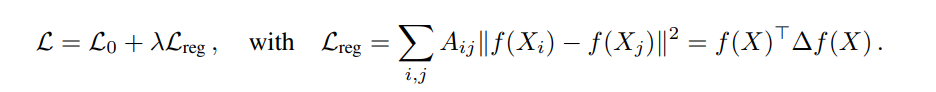

L0: supervised loss (graph 내 label이 있는 part)

Lreg: Laplacian matrix를 통해 연결된 node들 끼리 차이가 작은 방향으로 학습하게 함

**But node가 연결되어 있다는 사실이 similarity가 높다는 것을 보장하지 않기 때문에 model capacity를 떨어뜨린다.**

<aside>
💡 Conditioning f(·)  on the adjacency matrix of the graph f(X, A) will allow the model to distribute gradient information from the supervised loss L0 and will enable it to learn representations of nodes both with and without labels.
</aside>

nn에 인접행렬 집어넣어서 graph structure를 encode 하여 위에 regularization term을 loss function에서 없애고, label이 있는 node (supervised loss)에 대해서만 학습한다. 모델에 인접 행렬 집어넣어 supervised loss의 gradient information을 흘려보내고 이는 label이 있는 node 없는 node 모두 represent 할 수 있게 만든다.

GCN 논문의 contribution은 크게 두 가지가 존재한다.

1. NN에서의 layer-wise한 propagation rule을 graph에 적용하는 방법 제안
    - first-order approximation of spectral graph convolutions (Hammond et al., 2011)에서 motivated
2. gnn이 semi-supervised classification을 어떻게 빠르고 확장성이 있게 적용되는지 증명
    - 시간과 정확도 측정 실험 진행

# 2 FAST APPROXIMATE CONVOLUTIONS ON GRAPHS

그럼 nn에 어떻게 인접 행렬을 집어 넣을 건데? GCN의 구조는 다음과 같다.

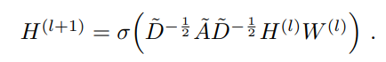

여기서 인접 행렬은 self-connected adjacency matrix 이다. degree of matrix 또한 자기 자신을 포함한 연결된 수를 의미한다. W(l)은 layer별 학습 가능한 파라미터가 담긴 matrix(layer-specific trainable weight matrix)를 의미한다.

## 2.1 SPECTRAL GRAPH CONVOLUTIONS

Graph 내 Spectral convolution 연산은 Fourier domain 에서 signal x (각 노드 별 scalar)와 filter (theta diagonal matrix)의 곱으로 만들어진다.

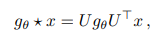

U는 laplacian matrix의 eigenvector들로 이뤄진 행렬이고, graph signal x에 U를 곱한 것은 graph Fourier Transform 과정이라고 볼 수 있다. g theta는 Laplacian eigenvalue들의 function 역할을 하여 적당한 가중치를 찾아내는 과정으로 보여진다. eigenvector matrix를 multiplication 하는 것은 O(N^2)의 complexity를 가지고 있으며, eigen decomposition 또한 큰 규모의 그래프에서는 expensive하다.

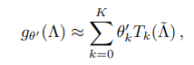

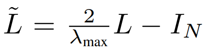

위와 같은 문제를 해결하기 위하여 laplacian matrix eigenvalue의 function g theta를 체비셰프 다항식을 이용하여 K번째 order까지만 사용하도록 well-approximate 하였다. (Hammond et al. 2011) 결과적으로, K-Localized filter를 구성하게 되었고, 중심 노드로부터 최대 K만큼 떨어진 이읏 노드들에만 depend하게 되었다. 즉 complexity는 O(|E|) edge의 개수 만큼으로 줄었으며, K-localized convolution을 정의하는데에 사용되었다.

## 2.2 LAYER-WISE LINEAR MODEL

위에서 유도된 식의 형태로 convolutional layer를 non-linearity를 가진 채 쌓음으로써 graph convolution을 하는 것이 가능해졌다.

convolution operation을 K=1 로 제한한다면?

이러한 경우 function이 linear 한 형태 L 이고, 이는 graph Laplacian spectrum 내에서 linear function을 의미한다. 그런데 이러한 방식으로 여러 개의 layer를 쌓는다면 우리가 원하는 형태의 convolutional filter function을 구성할 수 있다. 이러한 접근은 매우 넓은 node degree distiribution들을 가지는 graph에서 local neighborhood 구조에 의한 overfitting 문제를 피할 수 있게 한다. 그리고 고정된 계산 비용으로 인해, 모델로 하여금 더욱 깊게 nn을 구성할 수 있게 한다.

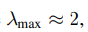

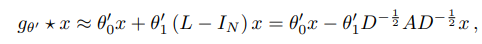

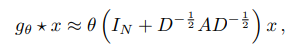

위 operator의 반복 적용은 dnn에서 흔히 겪는 exploding/vanishing gradient 문제를 야기하기에  renormalization trick을 통해 아래와 같이 재구성하였다.

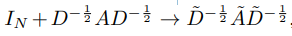

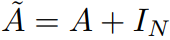

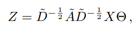

filter matrix parameter는 channel 의 수 (feature vector dimension) X filter 개수로 구성되며 만큼 쌓는다면 최종적으로 O(|E|FC) 만큼의 complexity를 가진다.

# 3 SEMI-SUPERVISED NODE CLASSIFICATION

그렇다면 f(X, A) propagation network는 어떻게 구성하여 semi-supervised node classification을 하는 걸까?

그래프 구조에 내재된 data X와 adjacency matrix A를 model에 conditioning 하여 그래프 기반 semi-supervised learning, 즉 adjacency matrix를 사용함으로써 data X만으로 represent 할 수 없었던 정보를 추출하는 상황을 기대하고 있다.

semi-supervised node classification을 위한 two-layer GCN

W0: input-to-hidden weight matrix for a hidden layer (C x H)

W1: hidden-to-output weight matrix (H x F)

A: pre-processing step에서 뽑아내는 normalized adjacency matrix

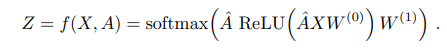

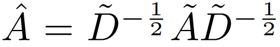

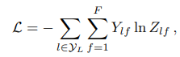

C dim에 해당하는 x feature에서 H만큼의 feature map을 뽑아 F개의 class에 대한 확률을 구한다.