# Neural Graph Collaborative Filtering

https://arxiv.org/pdf/1905.08108.pdf

# 1 INTRODUCTION

추천시스템은 어디에나 필요로 하고, Collaborative Filtering CF는 비슷한 유저는 비슷한 취향을 갖고 있을 것이라는 가정 아래 문제를 해결하고자 한다. 이러한 가정을 위해, user와 item을 historical interaction들을 바탕으로 parameter화하고, 이를 통해 user의 선호를 예측한다.

CF에는 크게 두 가지 중요한 component가 존재한다.

1) embedding: user와 item에 대한 representation을 구하기 위한 과정

2) interaction modeling: embedding을 기반으로 historical interaction을 reconstruct

대표적인 예로, Matrix Factorization은 user/item embedding을 구하고 내적함을 통해 interaction modeling 한다. 그 외에도, side information의 deep representation을 통해 MF embedding 과정을 extend한 collaborative deep learning, 기존 MF iteraction modeling 과정을 nonlinear NN으로 replace한 Nerural CF 등 다양한 시도들이 존재하였다.

그런데, 본 논문에서는 이 방법론들은 CF에 필요한 embedding을 뽑아내는데 충분치 않다고 본다. 이렇게 보는데 주요한 이유는 embedding function이 collaborative signal을 encoding 하는데 부족하다고 보고 있기 때문이다.

Collaborative signal은 user-item interaction에 있어서 latent한 요소로,  user(또는 item)들 사이 존재하는 behavioral similarity를 의미한다.

기존 방법들은 user-item interaction이 objective function에만 사용되곤 하여 embedding function에는 user/item id와 attribute 만이 사용되었다. 결과적으로 CF에 불충분한 embedding을 제공하였고, interaction modeling 함수에 의존적이게 된다.

**본 연구에서는** **상호작용 그래프 구조에서 협업 신호를 인코딩하는 자연스러운 방법인 사용자-아이템 상호작용의 high-order connectivity를 활용하여 문제를 해결한다**

—> high-order connectivity을 반영하는 구조로 embedding function을 재구성한다는 의미

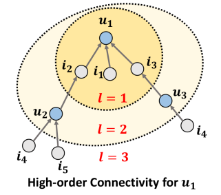

위 그림에서 high-order connectivity는 u1에서 시작하여 length l이 1보다 큰 지점에 존재하는 모든 노드로 이어지는 path들을 의미한다. (u1←i2←u2)는 u1과 u2가 i2에 대해 동일하게 반응한 behavior similarity를 의미하고, 이는 u1←i2←u2←i4 는 u1과 비슷한 u2가 소비한 i4를 선택할 가능성이 있다고 해석할 수 있다. 더 나아가 본다면, u1은 하나의 path(u1←i2←u2←i5)를 가진 i5보다 두 개의 path(u1←i2←u2←i4, u1←i3←u3←i4)를 가진 i4를 더 선호할 수 있다 

상호작용했던 item/user들을 집계하고 update하는 embedding propagation layer를 stacking함으로써 고차원적인 connectivity가 가지는 collaborative signal을 capture 해낸다.

ex. u1 ← i2 ← u2 는 두개의 layer를 쌓음으로써 behavior similarity를 capture하고 u1 ← i2 ← u2 ← i4 는 세 개의 layer를 쌓음으로써 잠재력있는 추천을 가능케한다. 이러한 흐름에 따라 embedding의 강도가 결정되고 i4, i5에 대한 추천 우선순위를 결정할 수 있다.

HOP-Rec 이라는 모델 또한 high-order한 connectivity를 제공하고자 고안되었으나, prediction model이 MF로 유지하여 high-order한 connectivity capture 능력을 저해시킨다. NGCF는 HOP-Rec과는 다르게 prediction model에도 high-order한 connectivity를 통합하는 과정을 추가하여 CF에 좀 더 유효한 embedding을 뽑는다.

세가지 contributions

1. CF에서 collaborative signal의 중요성을 증명
2. GNN embedding propagation을 통해 collaborative signal을 encode하는데 성공
3. SOTA 찍고, Embedding quality 올려놓았다

# 2 METHODOLOGY

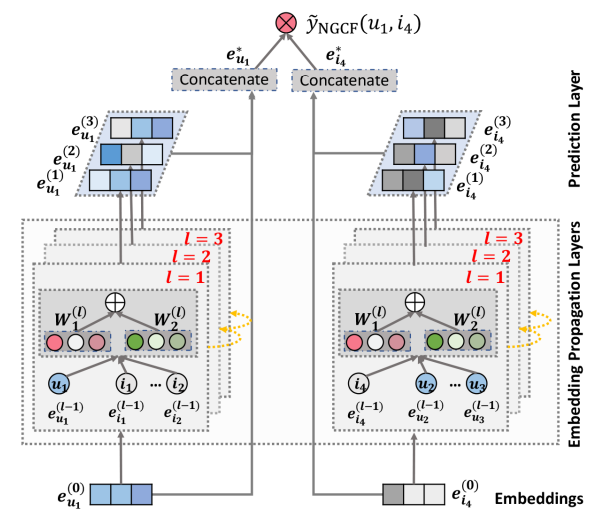

NGCF는 총 3가지 component로 구성

1. user/item embedding initialization layer
2. 고차원적인 연결성을 담도록 정제하는 embedding propagation layer
3. 정제된 embedding을 통해 user-item 간의 affinity score를 만드는 prediction layer

## 2.1 Embedding Layer

과거 CF 모델들은 ID embedding layer(look-up table 형태로 각 user, item 별로 고유한 embedding vector를 가질 수 있도록 구성된 layer)를 통해 나온 embedding 값 그대로 interaction 예측에 활용하였으나, NGCF는 ID embedding을 interaction graph에 넣어 refine한다. 이 embedding refinement는 collaborative signal을 embedding에 녹여낸다.

## 2.2 Embedding Propagation Layers

### 2.2.1 First-order Propagation

상호작용한 item은 user의 선호도에 대한 직접적인 증거가 되고 이와 비슷하게 어느 한 item을 소비한 유저를 해당 item의 feature로 다루거나 다른 두 item 간에 collaborative 유사성을 판별하기 위해 사용될 수 있다.

이러한 basis를 가지고, embedding propagation을 연결된 user들과 item들 사이에서 message construction과 message aggregation을 수행한다.

**Message Construction**

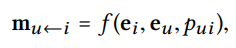

i에서 u로 가는 message embedding을 의미하고, item/user embedding ei, eu를 input으로 받고 coefficient pui를 통해 edge (u,i)의 decay factor 조절한다.

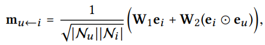

기존의 일반적인 GCN은 message를 전달하려는 대상의 contribution만을 고려하지만, 위에선 ei 뿐만 아니라 eu를 element-wise product한 값을 더함으로써 ei와 eu 사이의 affinity에 영향을 받도록 구성하였다. (user node와 더 비슷한 item node 일 수록 많이 반영)

pui를 graph laplacian norm 값으로 사용하는 일은

1. representation을 구하는 입장에서는 historical item이 user preference에 얼마나 반영될지를 정하는 일이고
2. message pass를 하는 입장에서는 path의 길이가 길어짐에 따라 영향력을 줄이는 역할을 한다.

**Message Aggregation**

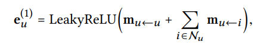

self-connection(mu←u) 을 통해 자기 자신에 대한 feature를 유지한 채 연결된 item들에 대한 message를 summation 함으로써 representation을 얻는다 

### 2.2.2 High-order Propagation

앞선 first-order connectivity modeling layer를 여러번 쌓음을 통해 더 고차원적인 connectivity를 이끌어낼 수 있다. 이는 user와 item 사이 relevance score를 구할 때 중요한 collaborative signal을 가지고 있다.

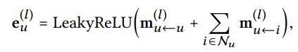

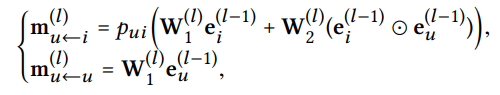

각 노드의 representation은 이전 message-passing step에서 나온 message들(l-1 hop neighbor information)을 기억해뒀다가 생성된다. 이는 각 layer 별로 representation을 얻을 수 있음을 의미한다.

**Propagation Rule in Matrix Form**

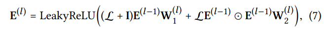

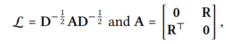

이렇게 matrix-form propagation 을 하면, 모든 user와 item 에 대한 representation을 동시에 업데이트 할 수 있고, 이는 node sampling 과정을 생략하여 복잡도를 크게 줄일 수 있다.

## 2.3 Model Prediction

L개의 layer를 통해 propagation을 마치고 나면, 총 L개의 representation이 얻어진다. 각 layer마다의 representation은 각기 다른 connection을 통해 전달된 message를 emphasize하고 있고 서로 다른 선호 강도가 담겨있다.

최종적으로는 L개의 representation을 concatenate를 진행하여 (user/item 에 대한) 하나의 representation을 얻는다

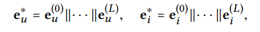

이를 통해 우리는 embedding propagation을 통해 representation을 풍부하게 할 뿐만 아니라 layer의 수를 제어함을 통해 어느 정도의 정보량을 담을지도 결정할 수 있게 되었다.

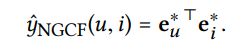

target item에 대한 user의 preference를 예측은 위와 같이 inner product를 진행한다