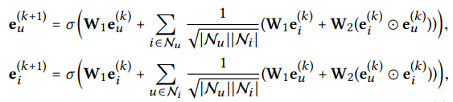
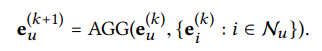
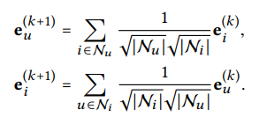
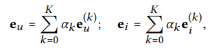

# **LightGCN: Simplifying and Powering Graph Convolution Network for Recommendation (SIGIR 2020)**

https://arxiv.org/pdf/2002.02126.pdf

# 1 INTRODUCTION

Collaborative Filitering (CF) 는 과거 user-item interaction 이력을 기반으로 개인화된 추천을 내놓는 추천시스템에서 기본적인 업무이다. CF는 보통 user와 item 각각을 표현할 수 있는 latent feature를 학습하고 해당 embedding vector들과 함께 prediction을 진행한다.

초기 모델인 Matrix Factorization은 각 user의 ID만으로 embedding을 만들어 냈지만, 이후 등장한 모델들을 통해 user의 interaction history를 활용하여 embedding의 quality를 올릴 수 있음을 확인했다.

- SVD++: user numerical rating 예측에 user interaction history를 활용

- NAIS: interaction history 통해 item들의 중요도에 차이를 두고 item ranking 예측

Graph 측면에서 바라본다면, 이러한 움직임은 user의 subgraph를 활용함으로써 이러한 개선들이 일어날 수 있다고 볼 수 있다. (user의 embedding learning에 one-hop neighbor들을 활용)

더욱 high-hop neighbors들의 subgraph structure를 활용하기 위해 GCN의 feauture transformation, neighborhood aggregation, non-linear activation 등 embedding vector refine 과정을 따라한 NGCF 모델이 등장하였다.

하지만 NGCF는 GCN의 영향을 많이 받은 탓에 연산과정이 과도하게 무거운 경향이 있다. GCN은 기본적으로 node 마다 다양한 attribute가 존재하는 graph 내에서 node classification을 하기 위해 설계되었기에 one-hot ID를 기반으로 하는 user-item interaction graph에 적합하지 못하다. 즉, ID embedding이 input으로 주어지고 non-linear 한 feature transformation을 여러 개의 layer를 쌓는 것은 큰 이익이 없고 도리어 model training 과정에 difficulty만 낳을 뿐이다.

GCN에서 영향을 받아 수행하는 feature transformation과 nonlinear activation 모두 NGCF의 효율성을 떨어뜨리고 있음을 실험을 통해 확인하였다. 더 놀라운 사실은 이 연산들을 지웠을 때 개선을 경험했다는 것이다. 이러한 실험들을 통해 얻은 결과를 바탕으로 본 논문에서는 GCN의 aggregation 과정을 포함한 LightGCN을 제안한다. LighGCN은 feature transformation과 nonlinear activation 과정을 생략하였으며, 각 propagtion layer를 통해 나온 embedding들의 weighted sum으로 final embedding을 구한다.

1. NGCF의 feature transformation and nonlinear activation 가 효과가 없음을 입증
2. recommendation 에 적합하게 설계된 GCN, LightGCN을 제안

# 2 PRELIMINARIES

## 2.1 NGCF Brief

eu0 는 user u의 ID embedding 값, ei0 는 item i의 ID embedding 값을 의미하고 user-item interaction을 활용하여 embedding을 propagate한다.

여기서 W1과 W2는 학습가능한 weight matrix로 각 layer에서 feature transform을 담당한다. 각 item과 user별로 L+1개의 embedding을 얻게 되고, 마지막으로 concatenation을 진행하여 최종적인 embedding을 얻고 이들을 inner product하여 prediction score를 구한다.

semi-supervised node classification에는 feature들에 대한 깊은 이해도가 필요했다. 그렇기에 multiple layers of nonlinear transformation은 feature learning에 큰 기여를 할 수 있었다. 그렇지만 CF에서는 user-interaction graph만을 가지고 학습하기에 이러한 연산을 필요로 하지 않는다.

# 3 METHOD

LightGCN은 GCN을 추천시스템에 맞게 고쳐내기 위하여 좀 더 경량화하고 효율적으로 구성한다.

## 3.1 LightGCN

GCN의 기본적인 아이디어는 그래프에 걸친 feature들을 smoothing 함으로써 node에 대한 representation을 학습하는 것이다. 이를 위해 graph convolution 연산을 반복적으로 진행한다. 즉, target node를 얻기 위해 아래와 같이 neighbor의 feature들을 aggregate하는 과정을 거친다.

AGG는 aggregation function으로 graph convolution의 핵심 연산이 된다. 

SUM aggregator(GIN), LSTM aggregator(GraphSAGE), bilinear interaction aggregator(BGNN)

대부분의 aggregator의 feature transformation 또는 nonlinear activation 과정은 AGG function과 함께 일어나는데, 이러한 연산은 CF에 있어서 부담일 수 있다.

### 3.1.1 Light Graph Convolution (LGC)

LightGCN 에서는 weighted sum aggregator를 사용하였고 feature transformation과 nonlinear activation 연산 작용을 지웠다.

GCN의 symmetric normalization term을 차용하여 grpah convolution에 의해 embedding의 크기가 커지는 것을 방지하였다. 

앞으로 설명할 layer combination operation에서 self-connection과 같은 역할을 하여 aggregate 과정에서 target node의 self-connection은 포함하지 않았다.

### 3.1.2 Layer Combination and Model Prediction

LightGCN에서는 trainable 한 model의 parameter는 첫 번째 layer에서 embedding을 담당하는 weight matrix 단 하나이다. 해당 wegiht matrix를 통해 나온 embedding은 K개의 layer를 타고 나와 총 K개의 embedding을 추가로 생성하고 각 embedding의 중요도를 결정하는 alpha 값을 통해 final embedding이 결정된다.

alpha 값은 hyper parameter tuning을 통해 구할 수 도 있고, attention network 와 같이 model의 parameter로 작용하도록 만들 수도 있지만 실험을 통해 1/(K+1)로 모두 동일하게 설정하였을 때 가장 좋은 성능을 나타냄을 확인하였다.

1. 여러 개의 layer가 생겼을 때 over-smoothing 되는 현상을 막기 위함
2. 각 layer마다 embedding은 다른 의미를 담고 있음
    - 1st layer: user-item 간의 interaction
    - 2nd layer: 공통으로 소비한 item(user)이 있는 user(item)들 간의 interaction
    - higher layer: higher-order proximity를 담고 있음
    
    이들을 combining 함으로써 representation을 구할 때 다양한 관계를 내포하도록 구성한다.
    
3. 각 layer마다 값을 weighted sum하는 것은 graph convolution에서 self-connection의 효과도 포함한다.

최종적인 prediction은 위 과정을 통해 나온 final representation을 inner product하여 구한다.