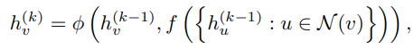

# HOW POWERFUL ARE GRAPH NEURAL NETWORKS? (ICLR 2019)

https://arxiv.org/pdf/1810.00826v3.pdf

# 1 INTRODUCTION

본 논문에서는 GNN variants 들이 서로 다른 그래프들을 얼마나 잘 구분할 수 있는지 표현하는데에 집중하였다. 이를 확인하기 위해서 다양한 그래프 클래스를 잘 구분하는 테스트인 Weisfeiler-Lehman graph isomorphism test를 사용하였다. 

GNN과 비슷하게도, 노드의 feature vector를 주변 노드의 feature vector들을 aggregate 함으로써 반복적으로 update한다. WL test의 강점은 다른 노드 이웃들은 다른 feature vector를 갖도록 mapping하는 injective aggregation update에 있다. 

논문의 key insight는 GNN이 표현력이 높은 aggregation scheme을 가지고 injective function을 modeling 할 수 있다면 WL 만큼 구분하는 능력을 가지고 있다라는 것이다. 수학적으로 증명하기 위해, 주어진 노드의 이웃 노드들의 feature들을 multiset으로 표현한다. 

그러므로 GNN에서 neighbor aggregation은 multiset 에 대해 aggregation function을 수행하는 과정이라고 볼 수 있다. 따라서 GNN은 다른 multiset들은 다른 representation으로 aggregate 할 수 있어야한다. 

각기 다른 function들을 바탕으로 얼마나 그래프를 잘 구별하는 능력을 가지고 있는지 연구하였고, 잘 구별하는 GNN은 더욱 좋은 representational power을 가지는 GNN으로 볼 수 있다.

### Summary

1. GNN은 graph structure을 구분하는 WL test만큼 대부분 강력했다
2. WL test만큼 강력한 경우 neighbor aggregation과 graph readout function에 condition을 설정했다.
3. 기존 GNN 모델들이 잘 구분하지 못하는 graph structure 들을 확인하였으며, GNN r기반 모델들이 capture 해내는 graph sturucture의 특성 또한 파악하였다.
4. WL test 만큼 강력한 구분 능력과 표현력을 가지는 Graph Isomorphism Network(GIN)을 개발하였다.

# 2 PRELIMINARIES

### Graph Neural Network

본 논문에서는 크게 두가지 GNN의 task를 다룬다. 

1. Node Classification

각 노드 v마다 label yv 가 존재하고 representation hv를 학습하는 것이 목표이다.

2. Graph Classification

각 그래프 G마다 label yG가 존재하고 각 graph 별로 representation vector를 학습하는 것이 목표이다.

GNN은 graph structure와 node feature Xv 를 각 노드 별 representation vector hv를 학습하거나 각 그래프 별 representation vector hG를 학습하는데 사용한다. 현대 GNN 모델들은 node의 이웃들의 representation을 aggregating 함으로써 해당 노드의 representation을 반복적으로 업데이트한다. k번의 aggregation 이후에는 k-hop information을 담고 있는 node representation 얻을 수 있다.

hvk는 k-th layer를 통해 나온 노드 v의 representation이며 hv0는 Xv로 initialize 된다. GNN에 있어 AGGREGATE(k) 와 COMBINE(k)는 매우 중요한 요소이다.

GraphSAGE의 neighbor node들에 대한 representation을 구하는 과정(Aggregate)에서 pooling 기법으로는 element-wise max-pooling을 사용하였다. 자기 자신의 노드 representation과 합치는 과정 (Combine)에서는 concatenation을 사용하였다. 두 가지 모두 Linear Mapping (Weight Matrix W)를 사용하는 과정이 존재한다

GCN은 element-wise mean pooling이 사용되었고 위 수식을 통해 Aggregate 와 Combine 과정이 통합된 것을 볼 수 있다.

다른 대부분의 GNN 모델들은 위와 비슷하게 표현된다.

Node classification에서는 마지막 layer를 통해 나온 hvk 에대한 node representation이 예측을 위해 사용된다.

Graph classification에서는 READOUT function이 마지막 layer에서 나온 그래프 내 존재하는 모든 노드들의 representation 바탕으로 graph에 대한 representation을 얻어낸다. READOUT function으로는 summation이나 graph-level에서의 pooling function이 선정되기도 한다.

### Weisfeiler-Lehman test

Graph Isomorphism 문제는 두 개의 graph가 topological 하게 동일한지 확인하는 것이다. polynomial-time algorithm이 알려져 있지 않고 그나마 WL test 가 graph isomorphism 판단 하는데 유용한 것으로 알려져있다. WL의 1차원 형태 (naive vertext refinement)는 GNN에서 neighbor aggregation 과 유사하다. 

WL test는 반복적으로 node의 label들과 node의 neighborhood를 aggregate하고 aggregate 된 label들을 새롭고 unique한 label로 hash한다. 알고리즘은 특정 iteration에서 두 그래프 노드들의 label이 다를 경우, label들이 두 개의 graph들을 non-isomorphic하다고 결정한다.

WL test를 기반으로 graph 간 similarity를 측정하는 WL subtree kernel이 제안되기도 하였다. kernel은 WL test의 다른 iteration에서 노드 label의 수를 그래프의 feature vector로 사용한다. 

왼쪽 Graph에서 WL test iteration을 2번 진행한 결과가 중앙 그림이라고 볼 수 있다. 따라서, WL subtree kernel에 의해 고려되는 그래프 특징은 본질적으로 그래프에서 서로 다른 뿌리를 둔 서브 트리의 수이다.

# 3 THEORETICAL FRAMEWORK: OVERVIEW

GNN은 network의 구조와 주변 노드의 feauter들(rooted subtree 구조)을 파악하기 위해 반복적으로 각 노드의 feature vector를 업데이트한다. 논문 전체에서, 그래프는 유한하다고 가정하고 깊은 layer의 node feature vector 또한 countable 하다고 가정한다. 

각 feature vector에는 각각 unique label을 할당한다. 그러므로 주변 노드로부터 온 feauter vector들은 multiset을 형성한다. 각기 다른 노드가 같은 feature vector를 가질 수 있기에 똑같은 element가 여러번 반복될 수 있다.

### Definition 1.

<pre>
<code>multiset은 해당 요소에 대해 여러 개의 instance들이 허용되는 set을 의미
2-tuple X = (S,m)
S: X의 고유한 원소로부터 형성되는 기본 집합
m : S → N ≥ 1은 원소의 다중성을 제공
</pre>
</code>
GNN의 표현력을 확인하기 위해선, GNN이 두 개의 노드에 대해 같은 embedding space에 mapping 하는지 분석해야한다. 직관적으로, 뛰어난 GNN은 각각의 노드가 동일한 subtree 구조를 가지고 있다고 했을 때 해당 두 노드는 같은 location으로 mapping한다. 

subtree는 node neighbor에 의해 정해지기에, GNN이 두 개의 neighborhoods (two multisets)을 같은 embedding 또는 representation으로 mapping하는지를 확인하면 되는 문제로 좁혀진다. 성능이 뛰어난 GNN은 절대로 다른 neighborhoods(multisets of feature vectors)를 같은 representation을 가지도록 mapping하지 않는다.

이것의 의미는 aggregation scheme 이 반드시 inhective 해야한다는 것이고, GNN의 aggregation scheme은 nn으로 표현될 수 있는 multiset function들이 injective 한지 확인하면 된다는 것이다.

# 4 BUILDING POWERFUL GRAPH NEURAL NETWORKS

첫번째로, GNN 기반 구조의 representational capacity 최대치를 확인하였다. 성능이 최대치인 GNN은 embedding space 상에서 다른 구조를 가진 그래프들을 다른 representation을 가지도록 할 수 있다. 여전히 graph isomorphism 문제는 피해갈 수 없지만 isomorphic graph들은 같은 representation을 가지게 되는 것을 원하고 있고, non-isomorphic 케이스들은 다른 representation을 가지는 것을 얻길 원한다. 이러한 능력, GNN의 표현 능력을 WL보다는 약간 약한 기준으로 확인해보고자 한다.

### Lemma 2.

<pre>
<code>G1 과 G2를 non-isomorphic graphs 이라 헀을때, 만약 GNN이 G1과 G2를 다른 embedding으로 매핑한다면 WL test 또한 G1과 G2는 not isomorphic 으로 판별
</pre>
</code>
모든 aggregation based한 GNN은 WL 만큼 graph를 구분하는데 있어 강할 것이다. 그런데, 기존에 존재하던 GNN들도 WL test 만큼 좋을까? Theorem 3에서 나오겠지만 대답은 yes이다. neighbor aggregation과 graph-level readout function이 injective 하다면 GNN의 결과는 WL test 만큼 강하다.

### Theorem 3.

<pre>
<code>충분한 GNN layer 수가 있고 아래 나오는 condition이 주어진다면, GNN은 WL test를 통해 non-isomorphic 으로 판별된 G1과 G2를 다른 embedding으로 매핑

a) GNN은 아래 수식과 같이 반복적으로 feature들을 aggregate하고 update

f: multisets 에 대하여 작용하는 function 

φ: injective function

b) GNN의 graph-level readout function 또한 injective
</pre>
</code>

Countable set들에 대해서는 injectiveness가 function이 input의 distinctness를 보존하였는지 잘 characterize한다. node feature들이 continuous한 Uncountable 한 set들에서는 몇가지 추가적인 고려사항이 필요하지만 본 논문에서는 countable set에서 나온 경우에만 초점을 둔다.

GNN의 중요한 이점

1. WL test는 feature vector를 one-hot encoding으로 구성해 subtree 간 유사성을 포착 x
2. GNN은 subtree를 저차원 공간에 임베딩하는 방법을 학습하여 WL 테스트를 일반화 
3. **이를 통해 GNN은 서로 다른 구조를 구별할 수 있을 뿐만 아니라 유사한 그래프 구조를 유사한 임베딩에 매핑하는 방법을 배우고 그래프 구조 간의 종속성을 포착할 수 있다.**

## 4.1 GRAPH ISOMORPHISM NETWORK (GIN)

Theorem 3에 기반하여 만들었고 WL test를 일반화하여 GNN 사이에서 구분 능력이 가장 좋다. neighbor aggregation을 위한 injective multiset function을 만들기 위해, nn으로universal multiset function을 parameterizing하는 deep multiset에 대한 이론을 개발하였다. 최종적으로 aggregate function으로 sum aggregator를 사용하였고, sum aggregator는 injective 하며 multiset들에 대해 universal한 function이다.

MLP가 functions의 composition을 표현할 수 있어 f(k+1) ◦ ϕ(k) 과정을 하나의 MLP로 대체 epsilon은 학습가능한 parameter로 사용해도 되고, 고정된 scalar 값으로 대체 가능하다.

## 4.2 GRAPH-LEVEL READOUT OF GIN

graph-level readout에서 중요한 부분은 node representaion이 layer 수가 증가함에 따라 범위가 global해진다는 점이다. layer가 많으면 Global한 특성만 남고, Layer가 적으면 local한 특성만 남기에 layer가 많은 경우 GNN의 고질적인 문제인 over-smoothing의 문제로 이어질 수 있다. 이러한 이유로 GIN에서는 모든 구조 정보를 담아내기 위하여 모든 layer에서 나온 result를 concatenation 하여 graph representation을 구한다.

