# Collaborative Large Language Model for Recommender Systems (WWW’24)

https://arxiv.org/pdf/2311.01343.pdf

# 1 INTRODUCTION

Recommender System(RS)은 user/item들이 unique하게 표현되고 그들의 embedding들은 유사성을 띄도록 설계되는 ID 기반 paradigm에 의해 지배되어왔다. random 하게 embedding이 initialize 되고 적절한 표현형을 historical interaction을 통해 찾아나가면 Matrix Factorization 이고 user/item feature 에 기반하여 찾아간다면 content-based method 들로 볼 수 있다.

최근, llm은 산업과 학계에서 크게 주목받고 있는 주제이다. 대용량의 corpus를 통한 GPT, T5, LLaMA 와 같은 거대 transformer network를 사전 학습하는 일은 비상한 능력을 보였으며 전례 없는 자연어 지식에 대한 이해도를 보여주었다. 계속해서 RS에서도 사전 학습된 LLM을 이용해 encoding 된 지식과 논리적인 추론 능력 그리고 생성 능력을 활용해user/item 이 가지는 의미를 이해하고 특히 user/item이 대량의 텍스트 정보를 담고 있다면 더욱 정확한 정확한 추천을 하고자 한다.

벌써 RS에서 LLM을 시도한 사례들은 존재한다. 크게 두 가지 step을 통해 이뤄지는데 먼저 user/item embedding을 나타내는 대신에 user의 관심사로 추천을 생성하는데 필요한 관련된 정보들을 자연어 기반 prompt로 변환한다. 그 다음 prompt를 LLM에게 넘겨주고 추천을 생성해낸다.

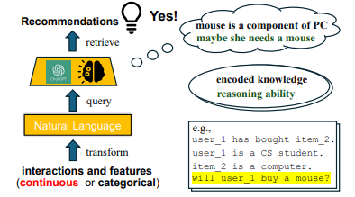

위 작업들은 zero-shot 방법을 통해 이뤄지고 추천들은 사전 학습된 LLM으로부터 얻어오거나 사전 학습된 LLM을 좀 더 RS-specific 한 지식 증강을 위해 fine-tuning한다.

꽤나 인상적인 진전을 이뤄냈지만, NLP와 추천 사이 근본적인 차이는 여전히 해결되어야한다. 하나의 주요한 과제는 자연어와 user/item sementics 간의 차이이다. LLM-based RS에서 user/item들을 표현하는데 두가지 전략이 있는데, Pseudo-ID 기반의 방법은 i번째 user 또는 j번째 item을 표현하기 위해 user_i 또는 item_j와 같은 ID-like word를 사용한다. 그런데 tokenize 된다면 그 ID-word는 atomic한 tokens들로 분해될것이고 user_4332 의 경우 ["user", "_", "43", "32"] 와 같이 tokenize 될 것이고 user_43과 user_32간의 correlation이 학습 된다든지와 같은 부정적인 영향을 나을 수 있다. 

대조적으로, description 기반의 방법론들은 의미론적으로 user/item들을 index하는 token들을 사용한다. 예를 들면 item들의 제목을 사용하거나 user/item의 content similarity에 기반하여 소량의 새로운 token들을 다른 user/item에 부여한다. 그런데 description-based method들은 과도하게 user-item semantic similarity를 기반으로 한 강한 inductive bias을 가지고 있다. 이는 user/item의 true semantic 발현을 어렵게 하는 요소로 작용한다. true user/item ID token들을 제공하는 것은 특히 랜덤하게 초기화된 많은 숫자의 user/item embedding들에 의해 LLM의 대부분의 어휘가 희석되었을 때, 직접적으로 heterogeneous tokens들의 sequence에 대해 LM을 수행한 것이기에 불가능하다.

user/item ID token embedding이 잘 학습되었다고 하더라도, LLM으로 추천을 만들어 내기엔 더 많은 문제들이 있다. 상호작용 순서는 직접적인 추천에는 영향을 주지 않는데, 인간의 언어는 순서를 갖고 있기에 사용자 과거 상호 작용을 텍스트 문장으로 변환할 때 ****다른 위치에 있는 item에 대해 가짜 시간 상관 관계를 도입할 수 있다.

content modeling에 있어서 LLM은 recommendation-oriented 되어있지 않기 때문에 추천과 무관한 user/item 텍스트에서 쉽게 noise를 포착한다. 게다가 LLM은 autoregressive하게 다음 토큰을 생성해내기에 여러 개의 추천을 LLM을 통해 만드는 것은 ID-based 방벙론들에 비해 비효율적이다. 마지막으로 pseudo-ID based 와 description-based indexing method 들은 hallucination을 피하기 위해 item 후보군들이 명시적으로 프롬프트를 통해 제공되어야한다. 이런 문제는 llm-based rs로 하여금 지연시간을 낳고 RS로의 실제 적용을 방해한다.

CLLM4Rec은 ID 패러다임을 LLM 기반 패러다임과 결합한 첫 generative RS이다. 사용자/아이템 협업/콘텐츠 의미를 충실하게 모델링하기 위해 사전학습된 LLM의 어휘를 user/item ID tokens 들과 함께 늘이고 embedding을 두 단계에 걸쳐 학습한다. 사전 훈련 단계는 user/item interaction 및 텍스트 특징으로부터 확립된 RS-specific corpus에 대한 언어 모델링을 통해 user/item token embedding을 학습하는 mutually regularized 협업 또는 콘텐츠 LLM들로 구성된다.

특히 heterogeneous token들과 함께 효율적인 언어 모델링을 하기 위해 soft+hard prompting 전략이 제안되었다. 각 document는 user/item 에 대한 soft token 과 vocab에 대한 hard token 들로 구성된 prompt와 homogeneous item token들(for collaborative filtering) 또는 vocab token(for content modeling)로 구성된 main text로 분해된다. 이 전략을 통해 두 개의 LLM의 예측 head는 collaborative / content 정보에 집중할 수 있어 언어 모델링의 안정성과 효과를 크게 향상시킬 수 있다. item reordering 전략은 item들의 순서가 주는 부정적인 영향을 줄여내어 collaborative LLM을 만들어내도록 한다. 

최종적으로 recommendation-oriented finetuning 기법을 제안하고 pretrained LLM backbone에 item prediction head를 추가함으로써 마스킹된 historical interaction에서 soft+hard prompt에 의거하여  hold-out item들을 예측할 수 있고 hallucination 없이 여러 item 추천을 효율적으로 생성할 수 있다.

세가지 contributions:

1. user/item ID token embedding을 LLM vocab space에 align하여 user 관심사와 item의 특성을 잘 잡아냄 (couples the ID paradigm and LLM paradigm)
2. historical interaction들과 user/item 특성들을 설명하는 heterogeneous token들을 soft+hard prompting strategy 을 통해 CLLM4Rec에 mutually regularized 방법으로 pretrain 한다. 이를 통해 user/item token embedding들에 의해 collaborative 하고 content 정보를 효율적으로 학습이 가능하다.
3. recommendation-oriented finetuning 기법은 multinomial likelihood item prediction head를 통해 마스킹된 상호작용으로부터 만들어진 soft+hard prompt에 기반하여 hold-out item들을 예측한다. 이 과정에서 hallucination 없이 여러 item들에 대한 추천이 생성 가능하다.

# 2 RELATED WORK

## 2.1 Large Language Model (LLM) Basics

LLM은 전례없는 자연어에 대한 이해도와 논리적인 추론 능력을 보여주었다. 언어 모델링에 사용된 transformer의 부분에 따라 현존하는 LLM은 크게 새가지 class로 나뉜다.

1. Encoder-Only LLM (BERT)
2. Encoder-Decoder-Based LLM (T5)
3. Decoder-Only LLM (GPT, LLaMA)

본 논문에서는 encoder-only models 들보다 월등한 생성 능력을 가진 decoder를 사용한 LLM들에 집중한다. LLM의 학습은 크게 두가지 단계가 있는데, pretraning 단계에선 large corpora를 언어 모델링을 통해서 학습(next/masked token prediction)한다. 학습 과정에서 stacking 된 self-attention 모듈들이 transformer weight에 knowledge encoding을 돕는다. 

그러면 finetuning 단계에서 여러 개 생성된 answer들에 대한 prompt-output 쌍이나 human feedback을 통해 LLM에게 제공된다. 이런 식으로 LLM은 논리적인 추론을 수행하고 pretrained 단계에서 인코딩된 지식을 기반으로 prompt에 따른 정답을 생성해낼 수 있다.

## 2.2 LLM in Recommender Systems

LLM 기반 RS는 ID 기반 RS가 오랫동안 해결하지 못한 문제들을 해결할 수 있는 잠재력을 보였다. 예를 들어, user/item textual feature들에 대한 낮은 이해를 보이거나 좋지 않은 일반화 성능에 대한 문제들을 존재한다. 현존하는 LLM들은 zero-shot 을 통해 user의 historical interaction과 item description을 통해 관련성이 높은 item들을 sort할 수 있음을 보였다.

최근에는 recommendation-oriented model들 얻기 위해 다양한 finetuning 기법들을 선보였다. P5는 T5를 item들은 모두 pseudo-ID로 표현한 채 user/item feature와 interaction을 사용하여 finetuning 하였다. M6는 pseudo iD들이 textual description들로 대체될 수 있도록 text infilling과 auto-regression tasks를 pre-training stage에서 함께 수행하였다. TALLRec은 item들이 pseudo-ID와 textual description 모두 사용하여 표현된다. 

그런데, pseudo-ID 기반의 item representation들은 관련없는 item들 사이의 부정적인 관계성 발현에 일조한다. 이러한 문제를 해결하기 위해, item들을 설명하기 위해 content와 collaborative similarity를 결정해주는 적은 수의 새로운 token들을 도입하였다.

그러나, 공유된 token 들을 통해 item들을 indexing 하는 것은 여전히 bias를 초래한다. 게다가 후보 아이템들은 prompt에 의해 제공되어야하고 recommendation은 비효율적으로 auto-regressive 하게 생성되어야 한다. 요약하자면, NLP와 RS 사이의 간극은 여전히 좁혀지지 못했다.

# 3 METHODOLOGY

## 3.1 Problem Formulation

본 논문에서는 implicit feedback 을 통한 recommendation에 집중한다. 

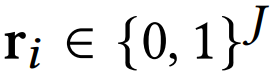

user i가 item set J 와의 interaction이 binary rating vector로 표현된 모습이며, user i와 item j 각각에 대해 x_i, x_j textual feature들을 사용한다. x_ij는 user i와 item j 모두에 연관된 textual feature들을 의미한다 eg. user i 의 item j 에 대한 review . textual sequence 내에서 k-th token은 x_k로 표현되고 size N one hot vector를 가진다.

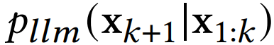

pretrained LLM을 확률론적인 관점에서 정의해보면 위와 같은 식으로 denote 할 수 있고 p_llm이 x_1:k 를 L개의 self-attention modules들을 통해 latent sequence h_1:k를 만들고, h_k를 next token인 x_k+1의 probability space로 mapping한다.

LLM을 대량 corpora에 대해 사전 학습하고 prompt-answer 쌍에 대해 fintuning 까지 했기 떄문에, x_k+1 생성은 x_1:k에 있는 context information을 기반으로 한 논리적인 추론이라고 볼 수있다.

user/item ID token (token embedding)들을 도입함으로써 LLM을 recommendation task에 맞게 만들어 생성형 RS를 만든 것이 목표이다. 이런 식으로 함으로써 user/item sementic (item에 대한 user의 관심도) 가 추천에 있어서 효과적이고 효율적인 방향으로 모델링 될 수 있고 사전 학습된 LLM에 encoding 된 지식과 추론 능력이 극대화 될 수 있다.

## 3.2 Extension of User/Item Tokens

### 3.2.1 Vocab Expansion

LLM을 recommendation task에 꼭 맞게 만들어주기 위해, user/item 의미를 본질적으로 설명해주기 위한 user/item ID token들을 추가함으로써 LLM의 어휘를 확장하였다. 이러한 어휘 확장을 통해 RS와 NLP 사이 존재하는 간격을 메워 줄 수 있다. 본 논문에서는 <user_i> 와 <item_j> 의 형태로 새롭게 도입된 token들을 표시하였다. i번째 user는 N+i ID를 가지고 j번째 item은 N+I+j token ID를 가진다. 이들은 더 이상 쪼개질 수 없는 atomic token이 된다. 

### 3.2.2 Token Embeddings

LLM에게 새롭게 도입된 user/item token들을 이해시키기 위해서, 새로 도입된 token들은 dense embedding으로 바뀌어야한다.

k 번째 vocab token의 사전 학습된 embedding을 표현하기 위해 z_k를 사용한다. token들이 새로 도입되었기에, user/item collaborative 하고 content semantic을 표현하기 위하여 vocab space에 align된 token embedding들의 두 가지 type을 도입하였다.

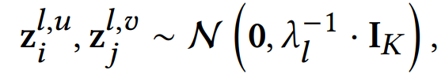

우선 user/item collaborative token embedding들을 K 차원의 latent space로 부터 위와 같이 샘플링한다. 여기서 \lambda_l은 z^l_i와 z^l_j에 대한 prior precision을 의미한다.

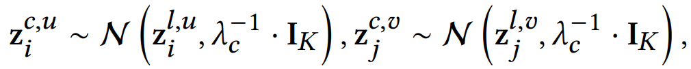

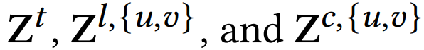

content semantic들을 collaborative semantic에 align 하기 위하여, user/item content token embedding을 위와 같이 sampling한다. 여기서 \lambda_c 는 z^c_i와 z^c_j에 대한 conditional prior이다. vocab/collaborative/content token embedding들을 수평적으로 stacking 한 matrix 형태는 맨 아래와 같이 표현된다.

### 3.2.3 CLLM4Rec Base Model

user/item token들과 각각에 대해 대응되는 token embedding들을 통해 CLLM4Rec base model을 학습 시킬 준비가 되었다.

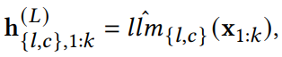

기본적으로 CLLM4Rec base model은 위와 같이 x_1:k를 hidden space에 L stacked self attention module을 통해 mapping한다. 여기서 x_k는 vocab, user, item 모두 고려한 size인 N+I+J one-hot vector이다.

llm^_{l,c}은 user/item token을 encoding하는 데 사용되는 embedding matrix를 나타낸다. CLLM4Rec base model 은 user/.item token embedding만 학습 가능할 뿐, vocab embedding 뿐 만아니라 LLM의 backbone part들은 사전 학습된 지식을 유지하기 위해 고정된다.

## 3.3 Mutually-Regularized Pretraining

LLM의 encoded knowledge와 논리적인 추론 능력을 온전히 활용할 수 있는 user-item interactions and user/item textual features로부터 생성된 copora를 언어 모델링하여 user/item collaborative/content token embeddings을 학습하는 것이 목표이다.

### 3.3.1 Recommendation-Specific Corpora

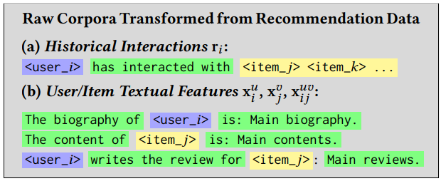

interaction r_i 와 user/item content feature들 x_i, x_j, x_ij를 token sequence들로 위와 같이 transform한다. 그러나, 각 document가 heterogeneous vocab, user과 item token들로 이루어져있기에 raw 한 corpora에 바로 language modeling을 하는 것은 불가능하다. 많은 수의 meaningful vocab token들(e.g., ∼ 50k for GPT, and ∼ 30k for T5)이 새롭게 도입되는 random 하게 initialize된 token들에 의해 희석될 수 있다.

### 3.3.2 Soft+Hard Prompting

위와 같은 문제를 피하기 위해 soft+hard prompting 기법을 제안한다. soft+hard prompting 기법은 RS-specific corpora인 heterogeneous 한 user/item/vocab token들에 대해 언어 모델링을 하기 위한 수단이다. 

user-item interaction r_i 와 user/item textual features x_i, x_j, x_ij 로부터 변형된 documents가 두개의 파트로 **문서의 요지에 관한 문맥 정보를 제공하는** soft (user/item) 과 hard (vocab) 한 token들의 Heterogeneous한 부분과 **detail 하게 pretext들을 채워 넣는** homogeneous한 item/vocab token들을 가진 main text 부분으로 나뉜다.

그러므로, 첫번째 part는 soft+hard prompt로, 두번째 파트는 언어 모델링을 수행하는 것으로 볼 수 있다. 이는 모델에게 collaborative 하고 content한 정보에만 집중할 수 있도록 하고 결과적으로 언어 모델링의 효과와 안정성을 상당히 높일 수 있다.

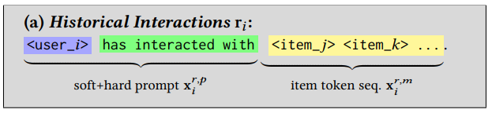

collaborative modeling을 위해서 user의 historical interaction들로부터 변형된 document x_i는 위와 같이 두개의 part로 나뉜다.

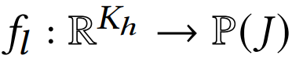

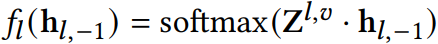

따라서, item prediction head f_l를 CLLM4Rec에 추가함으로써 collaborative LLM을 만들었다. llm_l에 의해 계산된 hidden representation을 probability space P(J) 로 mapping하여 다음으로 올 item token 에 대한 예측을 한다. f_l의 weight는 item collaborative token embedding들로 구성되어 위와 같이 계산된다.

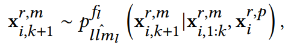

collaborative LLM의 생성 과정은 위와 같이 정의된다. prompt x_i^r,p 는 이전 item token들에 기반하여 다음 item token을 생성하기 위한 context를 제공한다. x_i,k+1 생성은 이전 토큰들을 attend 하기 때문에 likelihood를 maximize할때 collaborative LLM이 user i의 token embedding과 상호작용이 일어났던 item들에 대한 token embedding들을 가깝게 만들며 여기서 recommendation에서의 user/item collaborative semantic이 포착될 수 있다.

비슷하게도 x_ij 로부터 transform 된 문서도 soft+hard prompt와 main text로 나뉜다.

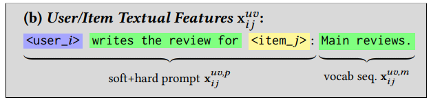

여기선 vocab prediction head f_c를 추가함으로써 content LLM을 만들었다.

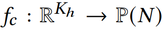

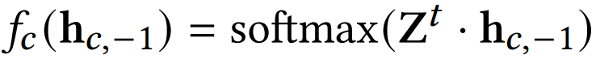

prediction head는 llm_c (위에서 사용된 똑같은 LLM이지만 user/item token을 decode할 때 Z^{u,v} 사용)에 의해 계산된 hidden representation을 vocab probability space로 mapping한다. 위에서랑 비슷하게 f_c는 vocab embedding들을 weight로 사용한다.

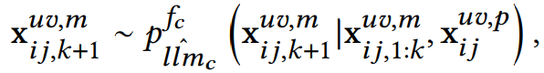

content LLM의 생성 과정은 위와 같이 정의된다. context로 작용하는 prompt와 함께 이전에 생성된 vocab token들을 기반으로 다음 vocab token을 생성한다. Likelihood를 maximize할 때, LLM의 사전학습된 지식들을 충분히 활용하며 x_ij에 존재하는 content information을 content token embedding들에 encoding 할 것이다.

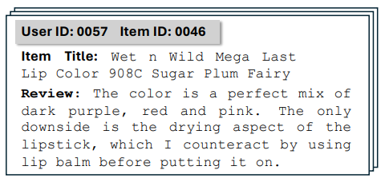

예를 들어, 위 리뷰의 경우, 사전 훈련된 LLM은 <item_46>이 짙은 보라색, 빨간색, 분홍색을 가진 립스틱으로 입술이 건조해지는 부작용이 있을 수 있으며, <user_57>이 색상을 좋아하지만 부작용을 싫어하는 이유를 알고 이를 완화할 수 있는 립밤에 대한 필요성을 알 수 있다.

### 3.3.3 Mutually-Regularization

사전 학습된 LLM은 reocommendation-oriented 하지 못하기에 content LLM 생성 과정에서 추천과는 무관한 content feature들로부터 오는 noisy information을 피할 수 없다. 게다가, user/item interaction이 sparse 한 탓에 collaborative LLM에서는 관측된 interaction들에 쉽게 ovefitting 될 수 있다. 

이런 문제를 해결하기 위해서 CLLM4Rec을 위한 mutually regularized pretraining 기법을 제안한다. collaborative LLM은 content LLM이 user/item content로부터 추천과 연관된 정보를 포착할 수 있도록 돕고, content LLM은 CF를 돕기 위한 side information을 제공한다.

mutual regularization은 CLLM4Rec의 align된 생성 과정에서 자연스럽게 등장한다. 아래 수식은 x_i^r (user i의 rating/interacted item) 과 x_ij^u,v (user i 의 item j와의 interaction/review) 을 만들어내는 과정을 담고 있다. 여기서 Z_i^c,v 와 Z_i^l,v 는 item j 뿐만 아니라 user i와 interacted한 다른 item들 모두 포함한다.

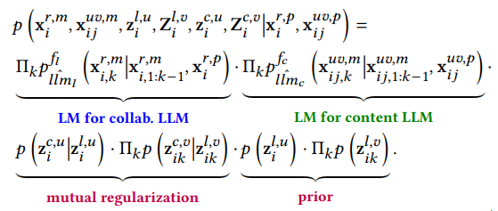

위 수식은 크게 3가지 part로 분해된다.

1. user/item token embedding을 학습하는 collaborative and content LLM의 언어 모델링
2. 두 LLM으로부터 나오는 token embedding들을 연결해주는 mutual regularization 
3. token embedding의 prior (mutual regularization 때문에 무시해도 됨)

mutual regularization term은 conditional Gaussian을 사용하며 log-likelihood를 maximize 하는 방향으로 설계되어 token embedding 들 사이의 MSE regularization을 진행한다.

user/item token embedding을 추정하기 위하여 joint distribution의 logarithm에 비례하도록 설계해 MAP(Maximum a Posteriori)를 사용한다. 여기서 MAP를 최적화하기 위해 다른 단계를 취한다. item token prediction head f_l 과 vocab token prediction f_c이 가지는 trainable parameter를 theta로 표기하고 collaborative LLM objective(L-step)과 content LLM(C-step)의 objective 각각 다음과 같다.

**L-step**

L-step에서는 user/item content embedding들을 바꾸고 collaborative LLM의 언어 모델링과 함께 user/item collaborative embedding을 제한하는데 사용한다.

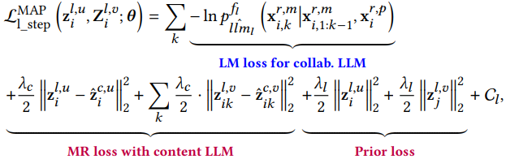

C_l은 optimization과는 무관한 상수이다. LM loss는 user i와 user i의 상호작용한 item들의 token embedding 사이 collaborative 유사도를 구한다. 그리고 MR Loss를 통해 side information이 CF를 돕기 위해 제공된다.

**C-step**

L-step의 optimization이 한번 끝나고 난 뒤에는 user/item collaborative token embedding이 update가 일어난다.

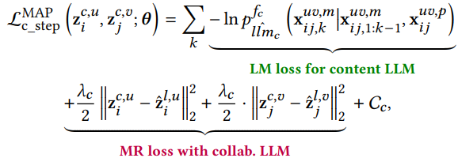

MR loss는 content LLM에게 user/item 텍스트로부터 recommendation-oriented 정보를 포착해낼 수 있도록 한다. \lambda_c 는 MR의 강도를 조절하는 요소로 작용한다.

### 3.3.4 Stochastic Item Reordering

historical interaction들 ri를 token sequence 로 변경할 때 item token들의 순서에 대한 문제가 존재한다. 사용자의 long-term 관심사는 고정되어 있다고 볼 수 있기 때문에 일반적으로 direct 추천에 Item order가 중요하지 않다. 중요하다고 하더라도 자연어의 순서가 아닌 interaction 순서의 의미는 포착하지 못할 수 있다.

이러한 문제를 해결하기 위해 collaborative LLM을 optimize할 때 item token들을 random하게 줄 세우는 stochastic item reordering 기법을 사용하였다. 이러한 기법을 통해 item의 순서가 주는 부정적인 영향을 줄일 수 있다.

## 3.4 Recommendation-Oriented Finetuning

### 3.4.1 Pretraining v.s. Finetuning

CLLM4Rec 의 사전 학습은 user-item interaction들과 user/item textual 특징들로부터 온 대량 corpora에서 user/item token embedding을 학습하기 위함이다. 이 과정을 통해 heterogeneous user/item/vocab token들이 포함된 prompt들이 CLLM4Rec에 의해 이해될 수 있다.

그러나 지금은, 사전학습된 CLLM4Rec은 recommendation을 내놓기보다는 prompt들에 기반하여 item/vocab token sequence들만을 complete할 수 있다. 즉, NLP와 RS 사이에 간극은 여전히 좁혀지지 않은 채로 있다. 게다가, collaborative LLM을 recommendation model로 다루는 것은 auto-regression을 통해 sequential 하게 추천하기 때문에 상당한 계산 비용이 든다. 그러므로 사전 학습된 collaborative LLM을 finetuning 하고 recommendation task에 맞게 바꾸기 위해 CLLM4Rec을 위한 recommendation-oriented finetuning strategy 을 제안한다. 

이를 위해 본 논문에서는 recommendation-oriented prompt들과 target들을 생성하기 위한 masked prompting 기법을 제안한다. 랜덤하게 상호작용한 item들을 100 X p_m%로 mask하고 남아있는 item들은 r_i^masked로 표기한다. r_i^masked는 prompt x_i^rec,p 에 들어간다. multi-hot vector r_i^hold 로 표기되는 모든 hold-out item들은 target으로 다뤄지고 최종적인 prompt와 target은 아래와 같다.

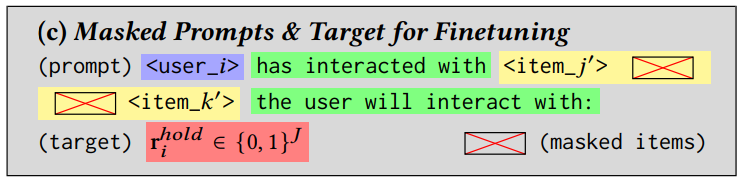

“has interacted with” 이라는 구문을 사용하여 사전 학습된 LLM의 추론 능력을 이끌어내고, “the user will interact with” 이라는 구문을 사용해 target인 hold-out items r_i^hold 에 대한 예측을 만든다.

CLLM4Rec finetuning 단계의 이름을 RecLLM으로 명명하고 pretraining 단계의 collaborative LLM으로부터 상속받아 multinomial likelihood를 통해 새로운 item에 대한 예측을 내놓는다. item token embedding을 weight와 결부되어 최종적인 output을 내놓는 f_rec layer를 사용한다.

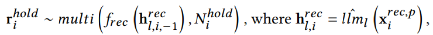

multi는 multinomial distribution을 의미하고 Ni hold는 user i의 hold-out item들의 수를 의미한다. RecLLM을 finetuning할때, user i의 historical interaction을 요약하는 h_l,i^rec이 latent variable이다. 해당 variable은 user가 interacted 한 모든 item들의 collaborative embedding들과 비슷해지도록 만든다. 그리고 content LLM과 함께 regularize 하는 과정 또 비슷하게 유지하는데, prompt를 생성할 때도 stochastic item reordering strategy를 사용한다.

이러한 과정을 통하여 CLLM4Rec은 사전 훈련된 LLM backbone에 인코딩된 지식과 mutually regularized 사전 훈련을 통해 학습된 user/item token embedding을 충분히 활용하면서 single forward propagation step에서 효율적으로 추천을 생성할 수 있다

여기서, target인 r_i^hold는 item probability space로 매핑되고 모든 item J에 대해서 제공되기에 hallucinated item들을 피할 수 있다.

## 3.5 Predictions with CLLM4Rec

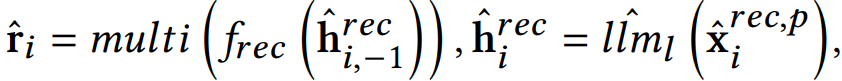

최종적으로 prediction을 내놓을 때는, prompt를 mask 없이 구성하고 RecLLM model에 input으로 넣어주게된다. multinomial probability r_i가 모든 item들에 대해 구해지기에 interact가 없는 item들에 대해서도 top-M score에 해당하는 item들이 추천으로 선택될 수 있다.